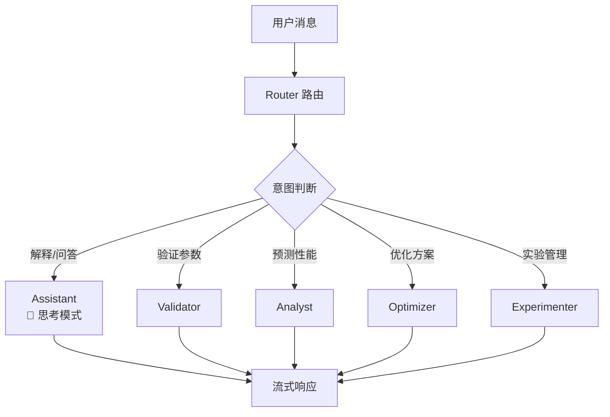

# TopMat Agent - 硬质合金涂层智能研发助手

## 📋 项目简介

TopMat Agent 是一个基于 **LangGraph** 的对话式多 Agent 智能系统，专注于硬质合金涂层（AlTiN 等）的研发优化。通过自然语言对话，为材料研发提供参数验证、性能预测、方案优化、实验管理等全流程支持。

### ✨ 核心特点

- 🤖 **对话式交互**: 自然语言驱动，智能理解用户意图
- 🧠 **多 Agent 协作**: 验证/分析/优化/实验专家智能路由
- 💭 **思考过程可见**: 展示 AI 推理过程，提升可解释性
- 📊 **实时流式输出**: WebSocket 双向通信，打字机效果
- 🔬 **专业工具集成**: TopPhi 模拟、ML 预测、历史案例检索
- 🎨 **现代化界面**: Vue 3 + Element Plus，简洁专业

## 🚀 快速开始

### 0. 获取代码

```bash
git clone http://192.168.6.104:3000/TopMaterial_Agent/CementedCarbide_Agent/src/branch/TangBin.git
```

### 方式一：Docker 部署（推荐生产环境）

**一键启动，无需安装依赖！**

```bash
# 1. 配置API密钥
cp .env.example .env
# 编辑 .env 文件，填入 DASHSCOPE_API_KEY

# 2. 构建并启动
docker-compose build
#或单独构建
docker build --file .\Dockerfile.frontend -t topmat_agent-frontend .
docker build --file .\Dockerfile.backend -t topmat_agent-backend .
# 启动
docker-compose up -d

# 3. 访问应用
# 前端: http://localhost
# API文档: http://localhost/api/docs
```

📖 详细说明: 
- [Docker 部署指南](DOCKER_DEPLOY.md)
- [VTK数据部署方案](docs/VTK数据部署方案.md) - 包含VTK可视化数据的部署选项

### 方式二：本地开发部署

#### 环境要求
- Python 3.11+
- Node.js 18+
- 阿里云百炼API密钥

#### 安装步骤

**1. 安装Python依赖**
```bash
pip install -r requirements.txt
```

**2. 配置环境变量**
```bash
# 复制并编辑后端配置
copy .env.example .env
# 编辑 .env 文件，填入你的阿里云百炼API密钥

# 复制前端配置（可选，使用默认配置即可）
cd frontend
copy .env.example .env
cd ..
```

**3. 安装前端依赖**
```bash
cd frontend
npm install
cd ..
```

**4. 启动后端（终端1）**
```bash
# 直接启动（开发模式，支持热重载）
python run.py

# 或生产模式（禁用热重载）
python run.py --no-reload
```

**5. 启动前端（终端2）**
```bash
cd frontend
npm run dev
```

**6. 访问应用**
- 🌐 前端界面: http://localhost:5173
- 📚 API文档: http://localhost:8000/docs
- 💚 健康检查: http://localhost:8000/health

### 配置说明

#### 后端配置 (`.env`)
| 配置项 | 必需 | 默认值 | 说明 |
|--------|------|--------|------|
| DASHSCOPE_API_KEY | ✓ | - | 阿里云百炼API密钥 |
| DASHSCOPE_MODEL_NAME | ✗ | qwen-plus | LLM模型名称 |
| SERVER_HOST | ✗ | 0.0.0.0 | 服务器监听地址 |
| SERVER_PORT | ✗ | 8000 | 服务器端口 |

#### 前端配置 (可选)
前端会自动使用 `http://localhost:8000` 作为后端地址。如需修改，可在 `frontend/.env` 中配置。

## 📖 使用指南

### 工作流程

1. **输入参数** → 填写涂层成分、工艺参数、结构设计
2. **智能分析** → TopPhi模拟 + ML预测 + 历史数据对比
3. **性能预测** → 硬度、结合力等性能指标预测
4. **优化建议** → 成分/结构/工艺三个维度的优化方案
5. **实验验证** → 选择方案，输入实验结果
6. **迭代优化** → 系统分析结果，智能决策下一步

### 界面特性

- 💬 **流式输出**: 实时显示AI分析过程，打字机效果
- 📊 **分步展示**: 各节点结果独立卡片显示
- 🎨 **Markdown渲染**: 支持表格、列表、代码块等
- 📈 **3D可视化**: TopPhi模拟结果VTK可视化
- 📜 **历史查看**: 查看历史迭代记录

## 🏗️ 系统架构

```
┌─────────────────────────────────────────┐
│                                         │
│  ┌──────────┐          ┌────────────┐  │
│  │ 浏览器    │ WebSocket│  FastAPI   │  │
│  │          │◄────────►│  Backend   │  │
│  │ Vue 3    │   HTTP   │            │  │
│  │ :5173    │◄────────►│  :8000     │  │
│  └──────────┘          └────────────┘  │
│                              │         │
│                        ┌─────▼──────┐  │
│                        │ LangGraph  │  │
│                        │  Workflow  │  │
│                        └────────────┘  │
│                                         │
└─────────────────────────────────────────┘
```

**架构特点**：
- ✅ 前后端分离，独立开发部署
- ✅ WebSocket实时双向通信
- ✅ LangGraph管理复杂工作流
- ✅ 配置文件统一管理

### 项目结构
```
TopMat_Agent/
├── frontend/                      # Vue 3 前端
│   ├── src/
│   │   ├── components/            # UI 组件
│   │   │   ├── chat/              # 聊天面板
│   │   │   ├── params/            # 参数输入
│   │   │   └── results/           # 结果展示
│   │   ├── composables/           # 组合式函数
│   │   │   ├── useMultiAgent.js   # 多 Agent 通信
│   │   │   └── useWebSocket.js    # WebSocket 封装
│   │   └── views/                 # 页面视图
│   └── package.json
├── src/                           # 后端源码
│   ├── agents/                    # 多 Agent 系统
│   │   ├── graph.py               # 对话式图构建
│   │   ├── state.py               # 状态定义 (TypedDict)
│   │   ├── content_extractor.py   # 结构化内容提取
│   │   ├── middleware/            # Agent 中间件
│   │   │   ├── config.py          # 中间件配置
│   │   │   └── context_middleware.py  # 上下文注入
│   │   ├── prompts/               # Agent 提示词
│   │   │   ├── validator.py       # 参数验证专家
│   │   │   ├── analyst.py         # 性能分析专家
│   │   │   ├── optimizer.py       # 优化建议专家
│   │   │   └── experimenter.py    # 实验方案专家
│   │   └── tools/                 # Agent 工具
│   │       ├── state_tools.py     # 状态更新工具 (Command)
│   │       ├── validation_tools.py
│   │       ├── analysis_tools.py
│   │       └── experiment_tools.py
│   ├── api/                       # FastAPI 后端
│   │   ├── main.py                # 应用入口
│   │   ├── routes/                # REST API
│   │   └── websocket/             # WebSocket
│   │       ├── routes.py          # 路由注册
│   │       ├── chat_handlers.py   # 对话处理
│   │       └── manager.py         # 连接管理
│   ├── llm/                       # LLM 服务
│   │   └── llm_service.py         # Qwen + 思考模式
│   ├── services/                  # 业务服务
│   │   ├── validation_service.py
│   │   ├── topphi_service.py
│   │   ├── ml_prediction_service.py
│   │   └── optimization_service.py
│   └── models/                    # 数据模型
├── .env                           # 环境变量
├── run.py                         # 启动脚本
└── requirements.txt
```

### 技术栈

**前端**
- Vue 3 + Composition API
- Element Plus + Naive UI
- Vite
- VTK.js (3D可视化)
- Pinia (状态管理)

**后端**
- FastAPI
- LangGraph
- 阿里云百炼 (Qwen)
- Uvicorn

**开发工具**
- 热重载支持
- 环境变量配置
- 统一配置管理

## 🔧 多 Agent 架构设计

### 系统架构

```
┌─────────────────────────────────────────────────────────────┐
│                      用户对话界面                            │
│                    (Vue 3 + WebSocket)                      │
└───────────────────────────┬─────────────────────────────────┘
                            │ WebSocket
┌───────────────────────────▼─────────────────────────────────┐
│                      智能路由 (Router)                       │
│              根据用户意图分发到合适的专家                      │
└───────┬───────────┬───────────┬───────────┬─────────────────┘
        │           │           │           │
   ┌────▼────┐ ┌────▼────┐ ┌────▼────┐ ┌────▼────┐
   │Validator│ │ Analyst │ │Optimizer│ │Experimenter│
   │参数验证  │ │性能预测  │ │方案优化  │ │实验管理   │
   └────┬────┘ └────┬────┘ └────┬────┘ └────┬────┘
        │           │           │           │
   ┌────▼───────────▼───────────▼───────────▼────┐
   │              Tools (工具层)                  │
   │  验证工具 | 分析工具 | 优化工具 | 实验工具   │
   └────────────────────┬────────────────────────┘
                        │
   ┌────────────────────▼────────────────────────┐
   │            Services (业务服务层)             │
   │  ValidationService | TopPhiService | ...    │
   └─────────────────────────────────────────────┘
```

### Agent 角色说明

| Agent | 职责 | 工具 |
|-------|------|------|
| **Router** | 智能路由，理解用户意图 | - |
| **Assistant** | 通用对话，解释性问题（带思考模式） | - |
| **Validator** | 参数验证，成分/工艺合理性检查 | 成分验证、工艺验证、归一化 |
| **Analyst** | 性能预测，调用模拟和 ML 工具 | TopPhi 模拟、ML 预测、历史案例 |
| **Optimizer** | 优化建议，生成 P1/P2/P3 方案 | - (Agent 自主生成) |
| **Experimenter** | 实验管理，工单生成和结果分析 | 性能对比、数据采集 |

### 对话流程



### WebSocket 消息协议

| 消息类型 | 方向 | 说明 |
|---------|------|------|
| `chat_message` | 前→后 | 用户发送消息 |
| `chat_start` | 后→前 | 开始处理 |
| `agent_start` | 后→前 | Agent 开始工作 |
| `thinking_token` | 后→前 | 思考过程流式输出 |
| `chat_token` | 后→前 | 回复内容流式输出 |
| `tool_start/end` | 后→前 | 工具调用状态 |
| `tool_result` | 后→前 | 工具返回结果 |
| `chat_complete` | 后→前 | 处理完成 |

### 关键技术特性

**1. 思考模式 (Thinking Mode)**

Assistant 使用 Qwen 的 `enable_thinking` 模式，展示推理过程：

```python
thinking_llm = QwenChatOpenAI(
    model="qwen-plus",
    enable_thinking=True  # 启用思考模式
)
```

**2. ReAct Agent 模式**

使用 LangGraph 的 `create_react_agent` 创建工具调用 Agent：

```python
expert_agent = create_react_agent(
    model=llm,
    tools=tools,
    state_schema=CoatingState,
    prompt=expert_prompt,
)
```

**3. 流式事件处理**

通过 `astream_events` 捕获所有事件并实时发送：

```python
async for event in graph.astream_events(state, config):
    if event["event"] == "on_chat_model_stream":
        yield {"type": "token", "content": chunk.content}
```

### API 文档

启动后访问 http://localhost:8000/docs 查看 Swagger 文档。

## 🎯 核心功能

**1. 对话式交互**
- 自然语言输入，无需复杂表单
- 智能理解意图，自动路由到合适专家
- 支持追问和解释性问题

**2. 参数验证**
- 涂层成分合理性检查
- 工艺参数范围验证
- 自动归一化处理

**3. 性能预测**
- TopPhi 第一性原理模拟
- ML 模型预测（硬度、结合力等）
- 历史相似案例检索

**4. 方案优化**
- **P1 成分优化**: Al/Ti 比例、微量元素
- **P2 结构优化**: 多层/梯度/纳米复合
- **P3 工艺优化**: 温度/气压/偏压调整

**5. 实验管理**
- 自动生成实验工单
- 实验结果分析
- 迭代优化建议

## 🐛 常见问题

**Q: 后端启动失败？**  
A: 检查 `.env` 文件中的 `DASHSCOPE_API_KEY` 是否正确配置。

**Q: 前端无法连接后端？**  
A: 确认后端服务已启动（http://localhost:8000），检查防火墙设置。

**Q: 如何修改服务端口？**  
A: 编辑 `.env` 文件中的 `SERVER_PORT` 配置项。

**Q: 如何查看日志？**  
A: 后端日志直接输出到控制台，前端问题检查浏览器开发者工具。

## 📄 许可证

MIT License

## 🤝 贡献

欢迎提交 Issue 和 Pull Request！

---

