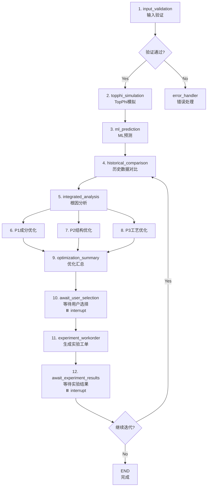

# TopMat Agent - 硬质合金涂层智能优化系统

## 📋 项目简介

TopMat Agent 是一个基于 **LangGraph** 的智能涂层优化系统，专注于硬质合金涂层的成分设计、结构优化和工艺改进。集成阿里云百炼大模型，为材料研发提供实时、智能的决策支持。

### ✨ 核心特点

- 🤖 **AI驱动**: 集成阿里云百炼Qwen大模型，智能分析预测
- 📊 **实时交互**: WebSocket流式输出，即时反馈分析过程
- 🔄 **迭代优化**: 支持多轮实验闭环，持续改进性能
- 💡 **三维优化**: 成分/结构/工艺三个维度的优化建议
- 🎨 **现代化界面**: Vue 3 + Element Plus，直观易用
- 📈 **VTK可视化**: TopPhi模拟结果3D可视化展示

## 🚀 快速开始

### 0. 获取代码

```bash
git clone http://192.168.6.104:3000/TopMaterial_Agent/CementedCarbide_Agent/src/branch/TangBin.git
```

### 方式一：Docker 部署（推荐生产环境）

**一键启动，无需安装依赖！**

```bash
# 1. 配置API密钥
cp .env.example .env
# 编辑 .env 文件，填入 DASHSCOPE_API_KEY

# 2. 构建并启动
docker-compose build
#或单独构建
docker build --file .\Dockerfile.frontend -t topmat_agent-frontend .
docker build --file .\Dockerfile.backend -t topmat_agent-backend .
# 启动
docker-compose up -d

# 3. 访问应用
# 前端: http://localhost
# API文档: http://localhost/api/docs
```

📖 详细说明: 
- [Docker 部署指南](DOCKER_DEPLOY.md)
- [VTK数据部署方案](docs/VTK数据部署方案.md) - 包含VTK可视化数据的部署选项

### 方式二：本地开发部署

#### 环境要求
- Python 3.11+
- Node.js 18+
- 阿里云百炼API密钥

#### 安装步骤

**1. 安装Python依赖**
```bash
pip install -r requirements.txt
```

**2. 配置环境变量**
```bash
# 复制并编辑后端配置
copy .env.example .env
# 编辑 .env 文件，填入你的阿里云百炼API密钥

# 复制前端配置（可选，使用默认配置即可）
cd frontend
copy .env.example .env
cd ..
```

**3. 安装前端依赖**
```bash
cd frontend
npm install
cd ..
```

**4. 启动后端（终端1）**
```bash
# 直接启动（开发模式，支持热重载）
python run.py

# 或生产模式（禁用热重载）
python run.py --no-reload
```

**5. 启动前端（终端2）**
```bash
cd frontend
npm run dev
```

**6. 访问应用**
- 🌐 前端界面: http://localhost:5173
- 📚 API文档: http://localhost:8000/docs
- 💚 健康检查: http://localhost:8000/health

### 配置说明

#### 后端配置 (`.env`)
| 配置项 | 必需 | 默认值 | 说明 |
|--------|------|--------|------|
| DASHSCOPE_API_KEY | ✓ | - | 阿里云百炼API密钥 |
| DASHSCOPE_MODEL_NAME | ✗ | qwen-plus | LLM模型名称 |
| SERVER_HOST | ✗ | 0.0.0.0 | 服务器监听地址 |
| SERVER_PORT | ✗ | 8000 | 服务器端口 |

#### 前端配置 (可选)
前端会自动使用 `http://localhost:8000` 作为后端地址。如需修改，可在 `frontend/.env` 中配置。

## 📖 使用指南

### 工作流程

1. **输入参数** → 填写涂层成分、工艺参数、结构设计
2. **智能分析** → TopPhi模拟 + ML预测 + 历史数据对比
3. **性能预测** → 硬度、结合力等性能指标预测
4. **优化建议** → 成分/结构/工艺三个维度的优化方案
5. **实验验证** → 选择方案，输入实验结果
6. **迭代优化** → 系统分析结果，智能决策下一步

### 界面特性

- 💬 **流式输出**: 实时显示AI分析过程，打字机效果
- 📊 **分步展示**: 各节点结果独立卡片显示
- 🎨 **Markdown渲染**: 支持表格、列表、代码块等
- 📈 **3D可视化**: TopPhi模拟结果VTK可视化
- 📜 **历史查看**: 查看历史迭代记录

## 🏗️ 系统架构

```
┌─────────────────────────────────────────┐
│                                         │
│  ┌──────────┐          ┌────────────┐  │
│  │ 浏览器    │ WebSocket│  FastAPI   │  │
│  │          │◄────────►│  Backend   │  │
│  │ Vue 3    │   HTTP   │            │  │
│  │ :5173    │◄────────►│  :8000     │  │
│  └──────────┘          └────────────┘  │
│                              │         │
│                        ┌─────▼──────┐  │
│                        │ LangGraph  │  │
│                        │  Workflow  │  │
│                        └────────────┘  │
│                                         │
└─────────────────────────────────────────┘
```

**架构特点**：
- ✅ 前后端分离，独立开发部署
- ✅ WebSocket实时双向通信
- ✅ LangGraph管理复杂工作流
- ✅ 配置文件统一管理

### 项目结构
```
TopMat_Agent/
├── frontend/                      # Vue 3 前端
│   ├── src/
│   │   ├── components/            # UI组件
│   │   ├── composables/           # 组合式函数
│   │   ├── stores/                # Pinia状态管理
│   │   ├── config/                # 配置文件
│   │   └── App.vue                # 主应用
│   ├── .env                       # 前端环境变量
│   └── package.json               # 前端依赖
├── src/                           # 后端源码
│   ├── api/                       # FastAPI后端
│   │   ├── main.py                # FastAPI主应用
│   │   ├── routes/                # REST API路由
│   │   │   ├── auth_routes.py     # 认证路由
│   │   │   └── vtk_routes.py      # VTK数据路由
│   │   └── websocket/             # WebSocket处理
│   │       ├── handlers.py        # 消息处理器
│   │       ├── manager.py         # 连接管理器
│   │       ├── executors.py       # 任务执行器
│   │       ├── routes.py          # WebSocket路由
│   │       └── serializers.py     # 数据序列化
│   ├── graph/                     # LangGraph工作流
│   │   ├── workflow.py            # 工作流定义与编排
│   │   ├── workflow_manager.py    # 工作流管理器
│   │   ├── nodes.py               # 节点实现
│   │   ├── state.py               # 状态定义
│   │   └── stream_callback.py     # 流式输出回调
│   ├── services/                  # 业务服务层
│   │   ├── coating_service.py     # 涂层优化核心服务
│   │   ├── optimization_service.py# 优化建议服务
│   │   ├── validation_service.py  # 输入验证服务
│   │   ├── topphi_service.py      # TopPhi模拟服务
│   │   ├── ml_prediction_service.py# ML预测服务
│   │   ├── historical_data_service.py# 历史数据服务
│   │   └── workorder_service.py   # 工单生成服务
│   ├── llm/                       # LLM服务
│   │   └── llm_service.py         # 统一LLM服务（阿里云百炼）
│   ├── models/                    # 数据模型
│   │   ├── coating_models.py      # 涂层数据模型
│   │   └── user.py                # 用户模型
│   ├── db/                        # 数据库
│   └── utils/                     # 工具函数
├── docs/                          # 文档
├── .env                           # 后端环境变量
├── .env.example                   # 环境变量示例
├── run.py                         # 启动脚本
└── requirements.txt               # Python依赖
```

### 技术栈

**前端**
- Vue 3 + Composition API
- Element Plus + Naive UI
- Vite
- VTK.js (3D可视化)
- Pinia (状态管理)

**后端**
- FastAPI
- LangGraph
- 阿里云百炼 (Qwen)
- Uvicorn

**开发工具**
- 热重载支持
- 环境变量配置
- 统一配置管理

## 🔧 后端架构与流程设计

### 架构设计

**分层架构**
```
┌─────────────────────────────────────────────┐
│  FastAPI Web层 (api/)                       │
│  ├── main.py          - 应用入口            │
│  ├── routes/          - REST API路由        │
│  └── websocket/       - WebSocket通信层     │
│      ├── handlers.py  - 消息分发与处理      │
│      ├── manager.py   - 连接管理            │
│      └── executors.py - 任务执行器          │
├─────────────────────────────────────────────┤
│  LangGraph工作流层 (graph/)                 │
│  ├── workflow.py      - 工作流定义          │
│  ├── nodes.py         - 节点实现            │
│  ├── state.py         - 状态管理            │
│  └── stream_callback.py - 流式输出         │
├─────────────────────────────────────────────┤
│  业务服务层 (services/)                     │
│  ├── coating_service.py - 核心业务逻辑     │
│  ├── optimization_service.py - 优化建议    │
│  ├── validation_service.py - 输入验证      │
│  ├── topphi_service.py - TopPhi模拟        │
│  ├── ml_prediction_service.py - ML预测     │
│  └── historical_data_service.py - 历史数据 │
├─────────────────────────────────────────────┤
│  LLM服务层 (llm/)                           │
│  └── llm_service.py   - 阿里云百炼封装      │
└─────────────────────────────────────────────┘
```

### LangGraph 工作流详解

**节点与数据流**



**工作流节点说明**

**阶段一：性能分析**（顺序执行）

1. **input_validation** - 输入参数验证
   - 验证成分配比、工艺参数、结构设计
   - 归一化成分数据
   - 流式输出验证结果

2. **topphi_simulation** - TopPhi第一性原理模拟
   - 模拟涂层沉积过程
   - 预测微观结构
   - 生成VTK可视化数据

3. **ml_prediction** - ML模型预测
   - 预测硬度、弹性模量等性能指标
   - 基于历史数据训练的模型
   - 提供预测置信度

4. **historical_comparison** - 历史数据对比
   - 检索相似配方的历史实验数据
   - 对比分析性能差异
   - 提供参考案例

5. **integrated_analysis** - 综合根因分析
   - 融合TopPhi、ML、历史数据
   - LLM分析性能问题根因
   - 生成结构化分析报告

**阶段二：优化建议**（并行执行）

6-8. **P1/P2/P3优化节点** - 三维优化建议
   - **P1_composition_optimization**: 成分优化（元素配比、微量添加）
   - **P2_structure_optimization**: 结构优化（多层、梯度、纳米复合）
   - **P3_process_optimization**: 工艺优化（温度、气压、偏压等）
   - 三个节点并行执行，独立调用LLM生成建议

9. **optimization_summary** - 优化方案汇总
   - 汇总P1/P2/P3建议
   - LLM生成综合推荐方案
   - 流式输出汇总结果

**阶段三：实验迭代**（用户交互）

10. **await_user_selection** - 等待用户选择 ⏸️
    - 使用 `interrupt()` 暂停工作流
    - 前端展示P1/P2/P3方案供用户选择
    - 用户选择后通过WebSocket恢复执行

11. **experiment_workorder** - 生成实验工单
    - 根据用户选择的方案生成详细工单
    - 包含具体的配方和工艺参数
    - 流式输出工单内容

12. **await_experiment_results** - 等待实验结果 ⏸️
    - 再次使用 `interrupt()` 暂停
    - 前端提交实验数据（硬度、磨损率等）
    - 用户决定是否继续迭代

**迭代循环**
- 若用户选择继续：回到 **historical_comparison** 节点，开始新一轮优化
- 若用户选择完成：工作流结束

### 关键技术特性

**1. 流式输出 (Stream Callback)**

所有LLM生成节点都支持流式输出，实时反馈给前端：

```python
def stream_callback(node: str, content: str):
    send_stream_chunk_sync(node, content)
    
# 在服务中调用
result = llm_service.generate_stream(
    prompt=prompt,
    stream_callback=stream_callback
)
```

**2. 工作流暂停与恢复 (Interrupt & Resume)**

使用LangGraph的 `interrupt()` 机制实现人机交互：

```python
# 暂停工作流，等待用户输入
user_input = interrupt({
    "type": "await_user_selection",
    "options": ["P1", "P2", "P3"]
})

# 前端提交后，使用Command恢复
command = Command(resume=user_data)
workflow.astream(command, config)
```

**3. 状态管理 (State)**

工作流状态 (`CoatingWorkflowState`) 贯穿整个流程：
- 输入参数：成分、工艺、结构、目标需求
- 中间结果：TopPhi、ML预测、历史数据
- 优化建议：P1/P2/P3内容
- 迭代历史：实验结果、选择记录

**4. WebSocket消息协议**

前后端通过WebSocket实时通信，主要消息类型：

| 消息类型 | 方向 | 说明 |
|---------|------|------|
| `start_workflow` | 前→后 | 启动新任务 |
| `llm_stream` | 后→前 | LLM流式输出 |
| `node_output` | 后→前 | 节点执行结果 |
| `workflow_paused` | 后→前 | 工作流暂停（interrupt） |
| `select_optimization` | 前→后 | 用户选择方案 |
| `submit_experiment_results` | 前→后 | 提交实验数据 |
| `optimization_completed` | 后→前 | 优化流程完成 |

**5. Service层模式**

业务逻辑封装在独立的Service类中，节点只负责调用：
- ✅ 代码复用（P1/P2/P3共用 `OptimizationService`）
- ✅ 职责分离（节点层 vs 业务层）
- ✅ 易于测试和维护

### 数据流示意

```
用户输入 → WebSocket → FastAPI
    ↓
  创建任务 → LangGraph Workflow
    ↓
  节点1: input_validation → ValidationService
    ↓ (流式输出)
  节点2: topphi_simulation → TopPhiService
    ↓ (流式输出)
  节点3: ml_prediction → MLPredictionService
    ↓ (流式输出)
  节点4: historical_comparison → HistoricalDataService
    ↓ (流式输出)
  节点5: integrated_analysis → LLMService (根因分析)
    ↓ (流式输出)
  并行节点6-8:
    ├─ P1 → OptimizationService → LLMService
    ├─ P2 → OptimizationService → LLMService
    └─ P3 → OptimizationService → LLMService
    ↓ (流式输出)
  节点9: optimization_summary → LLMService
    ↓ (流式输出)
  节点10: await_user_selection → interrupt ⏸️
    ↓ (等待前端提交)
  节点11: experiment_workorder → WorkorderService
    ↓ (流式输出)
  节点12: await_experiment_results → interrupt ⏸️
    ↓ (等待前端提交)
  条件判断: 继续迭代?
    ├─ Yes → 回到节点4 (新一轮迭代)
    └─ No → END
```

### API文档

启动后访问 http://localhost:8000/docs 查看完整的 Swagger 文档。

## 🎯 核心功能

**1. 智能分析**
- 多源数据融合（TopPhi + ML + 历史数据）
- 根因分析，解释性能背后的物理机制
- 流式输出，实时展示分析过程

**2. 三维优化**
- **P1 成分优化**: 元素配比、微量元素添加
- **P2 结构优化**: 多层/梯度/纳米复合结构
- **P3 工艺优化**: 温度/气压/偏压等参数

**3. 实验闭环**
- 生成详细实验工单
- 分析实验结果
- 智能决策下一步行动

**4. 可视化**
- TopPhi模拟结果VTK 3D可视化
- 时间序列动画播放
- 历史迭代记录查看

## 🐛 常见问题

**Q: 后端启动失败？**  
A: 检查 `.env` 文件中的 `DASHSCOPE_API_KEY` 是否正确配置。

**Q: 前端无法连接后端？**  
A: 确认后端服务已启动（http://localhost:8000），检查防火墙设置。

**Q: 如何修改服务端口？**  
A: 编辑 `.env` 文件中的 `SERVER_PORT` 配置项。

**Q: 如何查看日志？**  
A: 后端日志直接输出到控制台，前端问题检查浏览器开发者工具。

## 📄 许可证

MIT License

## 🤝 贡献

欢迎提交 Issue 和 Pull Request！

---

